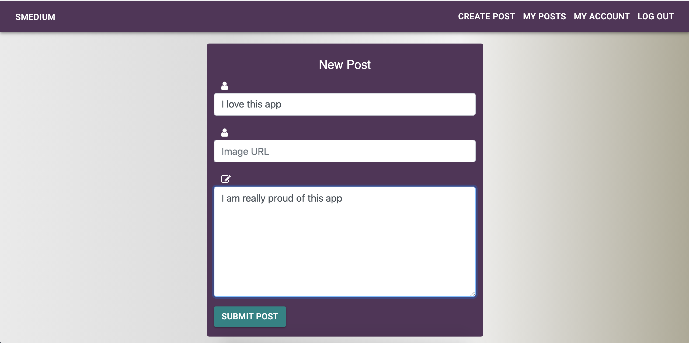
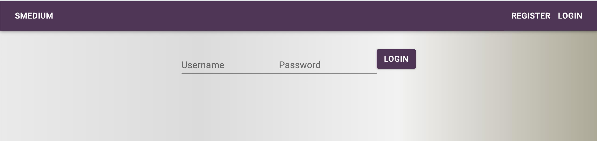

# User Story

Our Users would like to make posts and respond to each other in a very streamlined way. They would like to respond to their friends and conversations with the information being easily available. 

## The Issue
 * Needing a functional website that displays posts and languages and pictures I like 
 * Has to display completed posts, upload it to a server, allow for deletion and editing. 
 * Has a login feature so only people who are logged in to their account can make, edit and delete posts.
 * Create a backend server that scales out for all the added features developed in the future. 

## Overview
This will be a React based website that has an app bar and a MySQL database. The UX will be comprised of CSS using MaterialUI as a template. Pages will be controlled by using React Router DOM to for a streamlined experience and speed. Card components will be used to render posts and the project cards using the map funtion. Visitor information and comments can be logged on a server and sent to my email.

## Operation
As this was a group project we divided work into frontend and backend segments focusing mainly on operations and UI. We then worked on merging the frontend with the backend to create a complete application. After development the application was produced on Heroku for user testing and release. 

## Usage
#### Main Page
  * Page that displays posts from other users and the company banner. The page is rendered using react and links are organized by a react-router-dom. Passport and JsonWebToken is used to prevent people who haven't registered from seeing posts made by existing users. 
#### Create/Update Post
  * This page allows users to create a post with a title, url for pictures and an area for content. Once the submit button is clicked a copy of the post is shown. Viewers can return to the mainpage by clicking on the Smedium logo. The post will be located in order of when it was posted. 

#### Comments
  * By clicking on Users' posts another page renders and allows the user to make comments to the initial posts. These comments are also appended to the schema. 
#### Back-End
The backend uses MySQL and has the ability to be expanded to capture various aspects of user input. The smedium_schema.sql is the main schema used for organizing user data. The API.js in the React utils folder has the axios calls that allow the frontend to talk with the backend. 

## Usage
This app opens on the Main Page with the Smedium banner and any previous posts. 
  * Login: By clicking the Login link in the Navbar users can login with a previous username and password.
  * Register:

## Future Development
* Add like/unlike post option to each Post component so that only friends can rate posts
* Add search function
* Fix non login user from not seeing post on the front page
* Add multi language options
* Friends List
* Account setting where you can add your avatar/profile picture

## Gif of App

## App Links

Github Repo: https://github.com/iPan7/Smedium
Heroku Repo: https://smediumblog.herokuapp.com
